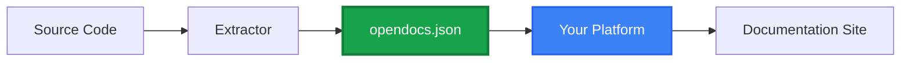

## Welcome, Platform Developers

You're building a documentation platform and want to support multiple programming languages without writing N parsers. OpenDocs is the solution.

## The Value Proposition

**Without OpenDocs:**
- Build a TypeScript parser
- Build a Python parser
- Build a Go parser
- Build a Rust parser
- ...repeat for 10+ languages

**With OpenDocs:**
- Parse `opendocs.json` once
- Support all languages that have extractors
- Focus on rendering, not parsing

## What You'll Build

Choose what fits your platform:

<CardGroup cols={2}>
  <Card title="Documenter" icon="file-code" href="/building/documenters/overview">
    Generate documentation sites from opendocs.json
  </Card>
  <Card title="UI Components" icon="paintbrush" href="/building/ui-components/overview">
    Build reusable documentation display components
  </Card>
  <Card title="Extractor" icon="code-branch" href="/building/extractors/overview">
    Add OpenDocs support for a new language
  </Card>
</CardGroup>

## Quick Start Paths

### For Documentation Platforms

**Goal**: Add opendocs.json import to your platform

**Steps**:
1. Read [Consuming opendocs.json](/building/documenters/consuming)
2. Traverse DocItems to build navigation
3. Render content with your templates
4. Done - you now support TypeScript, Python, Go, Rust, etc.

### For Static Site Generators

**Goal**: Generate Markdown/HTML from opendocs.json

**Steps**:
1. Read [Documenter Overview](/building/documenters/overview)
2. Parse opendocs.json
3. Generate pages per DocItem
4. Apply your theme

### For Component Libraries

**Goal**: Build React/Vue components for documentation

**Steps**:
1. Read [UI Components Overview](/building/ui-components/overview)
2. Create components that accept DocItem props
3. Handle different `kind` and `language` values
4. Publish to npm

### For Language Communities

**Goal**: Add your language to OpenDocs

**Steps**:
1. Read [Extractor Overview](/building/extractors/overview)
2. Use your language's AST tools
3. Convert to OpenDocs format
4. Validate against JSON Schema

## Architecture Overview



**Your platform consumes opendocs.json** - that's it. The rest of the ecosystem (extractors, model libs) handles the hard part.

## Core Skills Needed

### Parsing JSON

You'll parse opendocs.json:

```typescript
import fs from 'fs';

const docSet = JSON.parse(fs.readFileSync('opendocs.json', 'utf-8'));

// Now traverse projects and items
for (const project of docSet.projects) {
  for (const item of project.items) {
    // Render item
  }
}
```

### Traversing Trees

DocItems nest recursively:

```typescript
function renderItem(item: DocItem) {
  console.log(item.name);

  // Recurse into children
  item.children?.forEach(renderItem);
}
```

### Handling Different Languages

Different languages have different `kind` values:

```typescript
switch (item.kind) {
  case 'class':
    return renderClass(item);
  case 'rust-trait':
    return renderTrait(item);
  case 'go-interface':
    return renderGoInterface(item);
}
```

## Common Integration Patterns

### Pattern 1: Direct Rendering

Parse opendocs.json and render directly:

```typescript
const docSet = parseOpendocs('opendocs.json');
const html = renderDocSet(docSet);
writeFile('output/index.html', html);
```

### Pattern 2: Intermediate Format

Convert opendocs.json to your platform's format:

```typescript
const docSet = parseOpendocs('opendocs.json');
const markdown = convertToMarkdown(docSet);
writeMarkdownFiles(markdown);
```

### Pattern 3: Database Import

Import into a database for search/filtering:

```typescript
const docSet = parseOpendocs('opendocs.json');
await db.importDocSet(docSet);
// Now use database queries for rendering
```

## Next Steps

Choose your path:

<CardGroup cols={2}>
  <Card title="Build a Documenter" icon="file-code" href="/building/documenters/overview">
    Generate documentation from opendocs.json
  </Card>
  <Card title="Build UI Components" icon="paintbrush" href="/building/ui-components/overview">
    Create reusable documentation components
  </Card>
  <Card title="Build an Extractor" icon="code-branch" href="/building/extractors/overview">
    Add language support to OpenDocs
  </Card>
  <Card title="Specification" icon="book" href="/specification/overview">
    Deep dive into the spec
  </Card>
</CardGroup>
