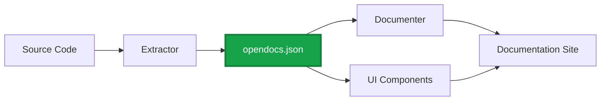

## Overview

The OpenDocs ecosystem consists of **4 categories** of software that work together to create a complete documentation pipeline:



## The 4 Categories

### 1. Model Libraries

**Purpose**: Language-specific implementations of the OpenDocs data model

**What they do**:
- Provide typed interfaces for `DocSet`, `Project`, `DocItem`, `DocBlock`, etc.
- Enable type-safe construction and validation of opendocs.json
- Used by extractors and documenters

**Examples**:
- `@opendocs/model` (TypeScript)
- `opendocs-model` (Python)
- `opendocs` (Go)
- `opendocs-rs` (Rust)

**Who uses them**: Extractor and Documenter developers

---

### 2. Extractors

**Purpose**: Parse source code and generate `opendocs.json`

**What they do**:
- Use language-specific AST parsers (TypeScript Compiler API, Python `ast`, Go `go/doc`, etc.)
- Traverse the syntax tree to extract documentation elements
- Convert to the universal OpenDocs format
- Output `opendocs.json`

**Examples**:
- `@opendocs/extractor-typescript` - Extracts from TypeScript/JavaScript
- `opendocs-extract-python` - Extracts from Python
- `opendocs-extract-go` - Extracts from Go
- `opendocs-extract-rust` - Extracts from Rust

**Who builds them**: Language enthusiasts, tool maintainers

**Official support**: OpenDocs will provide extractors for the top 10 most popular languages

---

### 3. Documenters

**Purpose**: Consume `opendocs.json` and generate documentation

**What they do**:
- Parse opendocs.json
- Traverse the DocItem tree
- Render documentation in various formats (Markdown, HTML, PDF)
- Generate navigation, search indices, cross-references

**Examples**:
- **Mintlify Plugin** - Add opendocs.json support to Mintlify docs
- **Astro Integration** - Use OpenDocs in Astro sites
- **Docusaurus Plugin** - Generate Docusaurus pages from opendocs.json
- **Static Site Generator** - Custom doc site builders

**Who builds them**: Documentation platform developers, static site generator authors

**Key use case**: Platform developers who want to support multiple languages without writing N parsers

---

### 4. UI Components

**Purpose**: Interactive components for rendering documentation

**What they do**:
- Display DocItems in rich, interactive formats
- Provide navigation, search, and filtering
- Render code signatures, parameters, relationships
- Support syntax highlighting and examples

**Examples**:
- **React Components** - `<APIReference>`, `<ClassDiagram>`, `<MethodSignature>`
- **Vue Components** - Vue versions of the same
- **Web Components** - Framework-agnostic components
- **CLI Renderers** - Terminal-based documentation viewers

**Who builds them**: UI library authors, component library maintainers

**Reusability**: A single React component library can work with TypeScript, Python, Rust, Go, etc.

## How They Work Together

### Typical Workflow

1. **Developer writes code** with documentation comments (TSDoc, docstrings, etc.)
2. **Extractor runs** (usually via CI/CD) and generates `opendocs.json`
3. **Documenter consumes** `opendocs.json` and generates a documentation site
4. **UI Components render** the documentation interactively

### Example: TypeScript Library

```bash
# Step 1: Extract documentation
npx @opendocs/extractor-typescript ./src --output opendocs.json

# Step 2: Generate docs with Mintlify
npx mintlify-opendocs opendocs.json

# Step 3: Serve docs
mintlify dev
```

The beauty: Change "TypeScript" to "Python" or "Go" and the **exact same Documenter and UI Components work**.

## Building for the Ecosystem

### For Platform Developers

You're building a documentation platform? Integrate OpenDocs once, support all languages:

1. Add opendocs.json import/parsing
2. Use the model library for your platform's language
3. Traverse DocItems and render with your templates
4. Done - you now support TypeScript, Python, Go, Rust, etc.

### For Language Communities

Want to add your language to OpenDocs?

1. Build an **Extractor** using your language's AST tools
2. Use the **Model Library** for type-safe output
3. Test against the JSON Schema
4. Submit to the ecosystem registry

### For Component Developers

Building reusable doc components?

1. Accept `DocItem` as props
2. Render based on `kind`, `language`, and `metadata`
3. Handle all relationship types (`extends`, `implements`, etc.)
4. Your component now works with any language

## Official vs Community Tools

### Official (Maintained by OpenDocs)

- Model libraries for Top 10 languages
- Extractors for Top 10 languages
- Reference implementations of Documenters
- Core UI component library

### Community (Built by the Ecosystem)

- Language-specific extractors for niche languages
- Platform-specific documenters
- Specialized UI components
- Platform integrations and migrations tools

## Next Steps

<CardGroup cols={2}>
  <Card title="Design Principles" icon="compass-drafting" href="/introduction/design-principles">
    Understand the philosophy behind the ecosystem
  </Card>
  <Card title="Build a Documenter" icon="file-code" href="/building/documenters/overview">
    Start building a documenter for your platform
  </Card>
  <Card title="Build an Extractor" icon="code-branch" href="/building/extractors/overview">
    Add OpenDocs support for a new language
  </Card>
  <Card title="UI Components Guide" icon="paintbrush" href="/building/ui-components/overview">
    Create reusable documentation components
  </Card>
</CardGroup>
