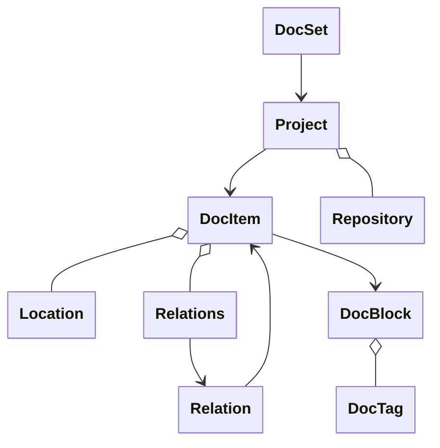

## What is OpenDocs?

OpenDocs provides a unified model that transforms documentation from any programming language into a consistent, navigable structure. Instead of maintaining separate models for TypeScript, Rust, Go, Python, and other languages, OpenDocs defines six core components that work together to represent documentation universally.

This approach eliminates complexity while providing complete flexibility for language-specific features and enabling rich tooling integration. The same mental model works for all languages, while preserving each language's unique characteristics.

## Mental Model: Everything is a DocItem

The key insight in OpenDocs is simple: **everything is a DocItem**. A module is a DocItem. A class is a DocItem. A method is a DocItem. Even a parameter is a DocItem. This consistent abstraction means you only need to understand one concept to navigate any codebase.

DocItems nest hierarchically through the `items` array:

```json
{
  "id": "my-lib#myModule",
  "name": "myModule",
  "kind": "module",
  "items": [
    {
      "id": "my-lib#Calculator",
      "name": "Calculator",
      "kind": "class",
      "items": [
        {
          "id": "my-lib#Calculator#add",
          "name": "add",
          "kind": "method",
          "relations": {
            "container": "my-lib#Calculator"
          }
        }
      ]
    }
  ]
}
```

**Visual hierarchy:**
```
Module (DocItem)
└── Calculator (DocItem)
    ├── add() (DocItem)
    ├── subtract() (DocItem)
    └── precision (DocItem)
```

This works because different languages have the same structural patterns - containers with members. TypeScript has modules with classes. Go has packages with structs. Python has modules with classes. The `kind` field captures language-specific types (`"class"`, `"struct"`, `"trait"`), while the structure remains consistent.

## The Six Core Components

OpenDocs uses six models that work together:

**DocSet** - The root object in `opendocs.json`
- Entry point for the entire documentation
- Contains metadata and an array of Projects
- Supports monorepos with multiple projects

**Project** - Individual project in a monorepo
- Specifies language (typescript, rust, go, python, etc.)
- Contains version and repository information for source linking
- Holds top-level DocItems (modules, packages, namespaces)

**DocItem** - Universal element representing any documentable code
- Has a language-native ID (`package#Symbol`, `crate::Type`, `package.Function`)
- Includes source location (file, line, column) for "Go to Definition"
- Nests hierarchically through `items` array
- Links to related items via `relations`

**DocBlock** - Structured documentation content
- Description text extracted from code comments
- Tags organized in a `Record<string, (string | DocTag)[]>` format
- Normalizes TSDoc, Javadoc, rustdoc, Python docstrings to common structure

**DocTag** - Individual documentation tag
- Represents `@param`, `@returns`, `@deprecated`, etc.
- Supports both simple strings and complex parameter structures
- Enables consistent rendering across documentation formats

**Relation** - Flexible relationship model
- Describes how DocItems connect (container, extends, implements)
- Supports simple strings, complex objects, or arrays
- Language-specific relations (rust-trait-impl, go-receiver-method)

## How They Connect

The six models form a hierarchical structure where each plays a specific role:



**Data flow:**
1. **DocSet** (the `opendocs.json` file) contains metadata and an array of Projects
2. **Projects** contain top-level DocItems (packages, modules, namespaces) and optional Repository info
3. **DocItems** nest hierarchically through the `items` array
4. Each **DocItem** may include source **Location** (file path, line number, column)
5. **DocItems** reference related items via **Relations** (container, extends, implements, etc.)
6. **Relations** contain **Relation** objects linking to other DocItems
7. **DocItems** link to their documentation via **DocBlock**
8. **DocBlocks** organize tags in arrays for structured metadata

## Three Learning Paths

Choose your path based on what you need:

<CardGroup cols={3}>
  <Card title="Quick Start" icon="rocket" href="/model/quick-start">
    **New to OpenDocs?** Start here to learn the model hands-on with minimal examples in 5 minutes.
  </Card>
  <Card title="Real Examples" icon="code" href="/model/examples">
    **Want to see real outputs?** Explore actual extractor outputs from TypeScript, Go, and Python sandboxes.
  </Card>
  <Card title="Complete Reference" icon="book" href="/model/reference">
    **Building an integration?** Get detailed field-by-field specifications for all six models.
  </Card>
</CardGroup>

## Key Design Principles

**Language-Native IDs**: Each language uses its natural naming convention for fully qualified names. TypeScript uses `package#Symbol`, Rust uses `crate::Type`, Go uses `package.Function`, Python uses `module.Class.method`. This makes IDs intuitive and enables IDE integration.

**Source Locations**: Every DocItem includes its source location (file, line, column), enabling "Go to Definition" features and source code linking with repository URL templates.

**Flexible Relations**: The relations model supports three formats (string, Relation object, array) to handle both simple references and complex relationships with metadata.

**Cross-Format Normalization**: Different documentation formats (TSDoc, Javadoc, rustdoc, Python docstrings) all normalize to the same DocBlock structure, enabling consistent rendering and cross-language documentation tools.

## Next Steps

**For integrators building platforms:**
- Read the [Quick Start](/model/quick-start) to understand the format
- Study [Real Examples](/model/examples) to see actual outputs
- Reference the [Complete Specification](/model/reference) when implementing

**For extractor developers:**
- Follow the [Implementation Guide](/opendocs/implementation/overview)
- Use [Real Examples](/model/examples) as templates
- Ensure compliance with the [Complete Reference](/model/reference)

**Understanding the ecosystem:**
- [File Organization](/opendocs/opendocs-file-organization) - How to structure documentation files
- [Design Principles](/opendocs/design-principles) - Philosophy behind OpenDocs decisions
